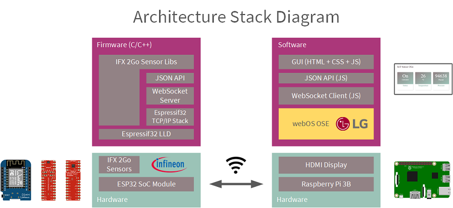
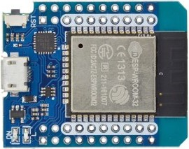
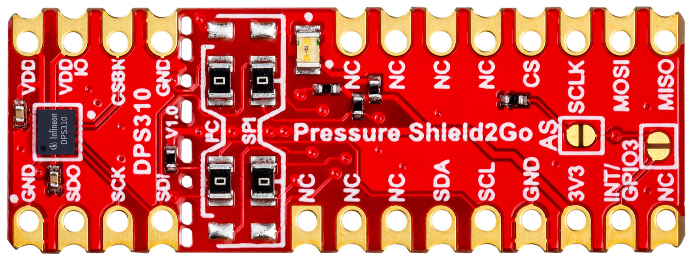
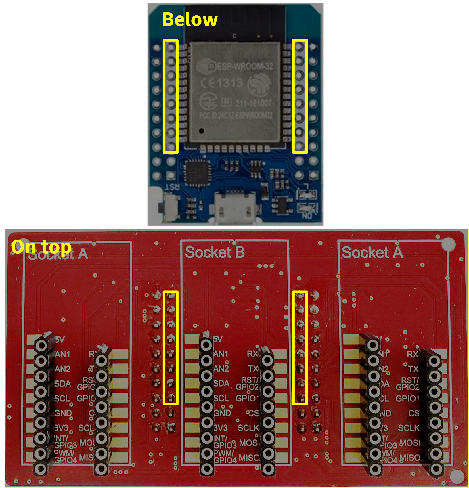
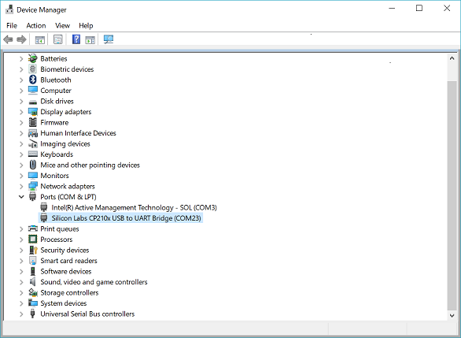
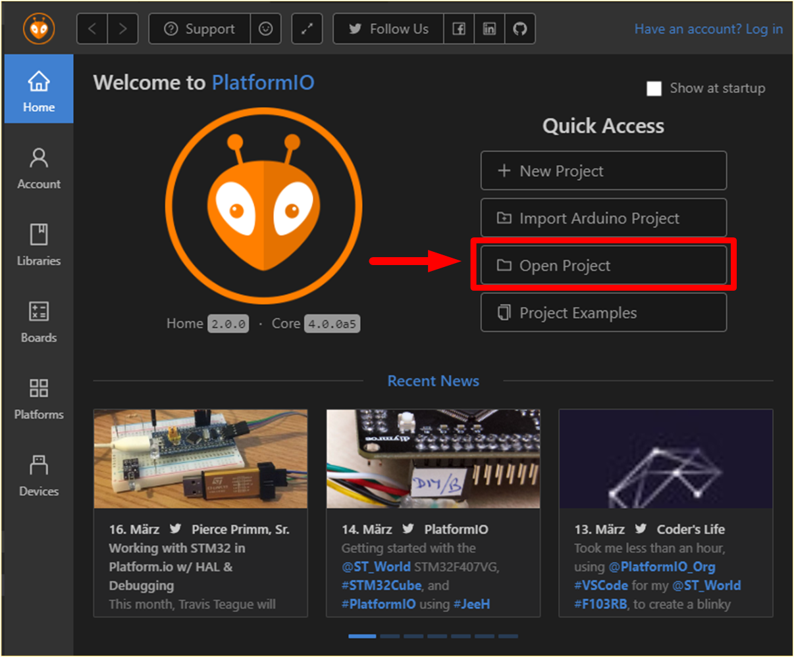
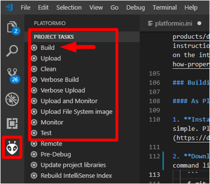
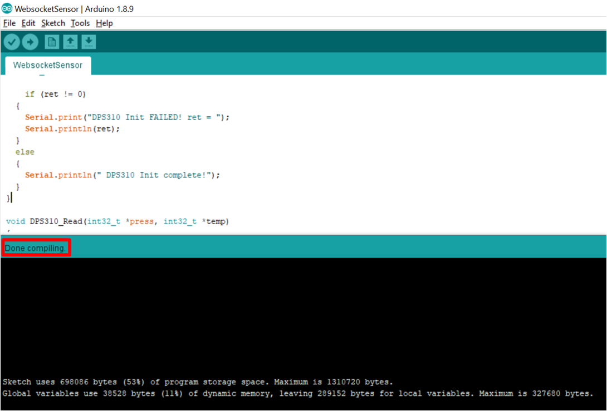
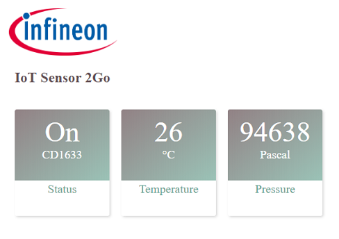

# IoT Sensor 2Go in webOS OSE

 1. [Overview](#overw) 
 2. [Hardware Requirements](#hw-req)
 3. [Software Requirements](#sw-req)
 4. [Sensor Node Setup](#node-setup)
 5. [webOS Setup](#webOS-setup)
 6. [References](#refs)

<a name="overw"></a>

## 1. Overview
-----------------------------
The project contains an example of a wireless sensor node using the ESP32 Wemos SoC module and the Infineon Shield2Go sensor boards. The sensor is connected using WebSockets to a Web Application for webOS OSE on Raspberry Pi 3B.

Features:
 - WebSocket based communication:
    - Server on sensor node
    - JS Client on Web App webOS on Raspberry Pi 3 B
 - Basic JSON API for sensor node data request
 - Sensor node application example:
   - Unique device identification using Optiga Trust X
   - Ambient pressure and temperature using DPS310 
 - webOS Web App sensor data dashboard (HTML+ CSS + JS)
     



<a name="hw-req"></a>
## 2. Hardware Requirements
-----------------------------
### Sensor Node

Required components:

 - MH-ET LIVE MiniKit for ESP32  

 - Shield 2Go 3 Sockets Adapter Board 

 - [Optiga Trust X](https://github.com/Infineon/arduino-optiga-trust-x) Shield2Go  

 - [DPS310 Pressure Sensor](https://github.com/Infineon/DPS310-Pressure-Sensor) Shield2GO  
  
The rest of the sensors of the [Infineon XENSIV™ - Sensor 2GO kits](https://www.infineon.com/cms/en/product/promopages/sensors-2go/#getting-started-box-iot) are supported but have not been used in this example:
 - [TLV493D-A1B6 3D Magnetic](https://github.com/Infineon/TLV493D-A1B6-3DMagnetic-Sensor) Sensor Shield2Go
 - [IM69D130 MEMS Microphone](https://github.com/Infineon/IM69D130-Microphone-Shield2Go) Shield2Go
 - [TLI4970-D050T4 Current](https://github.com/Infineon/TLI4970-D050T4-Current-Sensor) Sensor Shield2Go

### Host Client
 - Raspberry Pi Model 3B (not +) 
 - SD Card 8 GB
 - Power Supply +5 VDC for RPi or USB Micro Power Cable
 - HDMI Display Monitor

### Others 
 - USB Micro Cable 
 - USB Mouse
 - USB Keyboard
 - SD Card Reader
 
<a name="sw-req"></a>

##  3. Software Requirements 
-----------------------------
### Desktop Software
   - Windows 10 
   - Firmware IDE. Two alternatives:
      -  [Visual Studio Code 1.32.1 #05f146c](https://code.visualstudio.com/) + [PlatformIO (Home 2.0.0 + Core 4.0.0a4)](https://platformio.org/install/ide?install=vscode) (**Recommended**)
      -  [Arduino IDE V.1.8.9](https://www.arduino.cc/en/Main/Software) (**Alternative**)
   - [Python 3.7.2](https://www.python.org/downloads/) 
   - [CP210x USB to UART Bridge VCP Drivers](https://www.silabs.com/products/development-tools/software/usb-to-uart-bridge-vcp-drivers)
   - [Win32 Disk Imager](https://sourceforge.net/projects/win32diskimager/)
   - webOS Raspberry Pi Image (included in the repository)
   - [Ares webOS CLI](http://webOSose.org/download_file/pforce/6950/8436/)

### Firmware Libraries

- [ifx-esp32-node](link_to_this_repo) (this repository :))

If the **recommended** Visual Studio Code + PlatformIO IDE is used, no fimrware libraries needs to be downloaded. PlatformIO itself will take care of downloading the libraries and manage the dependencies.


If the Arduino IDE is chosen, any non-official library has to be installed manually, and previously donwloaded. For this example, the following are required:

 - [OPTIGATrustX V.1.0.5](https://github.com/Infineon/arduino-optiga-trust-x/archive/v1.0.5.zip)
 - [DPS310 V.1.0.6](https://github.com/Infineon/DPS310-Pressure-Sensor/releases/download/V1.0.6/DPS310-Pressure-Sensor.zip)
 - [ESP8266-WebSocket](https://github.com/morrissinger/ESP8266-Websocket/archive/master.zip)

 The rest of the libraries can be downloaded and installed directly from the Arduino IDE library/board manager:
  - esp32 V1.0.1 (Boards)
  - ArduinoJson V6.9.1

<a name="#node-setup"></a>   

## 4. Sensor Node Setup
-----------------------------
### Connecting the Hardware

Stack the adapter shields with the Shield2Go sensors on top of the ESP32 module, aligning the inner row using the pins marked in yelow in the picture below:




### Installing ESP32 USB - UART drivers

The **MH-ET LIVE MiniKit for ESP32** module uses the USB interface for programming and as application serial communication.
The first time it is connected, Windows will normally recognize the new device and install the necessary drivers.
If that is not the case, download them from the [link](https://www.silabs.com/products/development-tools/software/usb-to-uart-bridge-vcp-drivers). The instructions about how to manually install peripherals drivers on Windows Device Manager can be easily found on the internet (i.e. [link](https://www.windowscentral.com/how-properly-update-device-drivers-windows-10)).



### Programming the IoT sensor 

#### A. As PlatformIO Project

1. **Install the IDE**. Installing Visual Studio Code with Platformio is quick and simple. Please follow the instructions on the [official documentation website](https://docs.platformio.org/en/latest/ide/vscode.html#installation).

2. **Download this repository** or clone it as preferred. For example using the command line:
    ```
    $ git clone https://github.com/Infineon/iot-sensor-websocket.git
     ```
3. **Open the project in PlatformIO**. Go to PlatformIO home in Visual Studio Code, and open the project indicating the path:

    

4. **Set the WLAN Credentials**. Change the example WiFi credentials to the those of your network in the file **"lib/WiFiAccess/WiFiAccess.h"**:

   ```
   ...
   #define WIFI_SSID_OFFICE "my_office_wifi_ssid"
   #define WIFI_PASS_OFFICE "wifi_password"

   #define WIFI_SSID WIFI_SSID_OFFICE
   #define WIFI_PASS WIFI_PASS_OFFICE
   ```

5. **Build the example**. By clicking on the Platformio tab, in the explorer section all the Project tasks are shown. Click on "Build":

   

   The first time the project compiles, PlatformIO will go through the list of dependendencies, download, install and compile them. 
   If everything went fine we will get a **SUCCESS** message. We are now ready to run our wireless WebSocket sensor node :)   

6. **Upload and monitor the example** by clicking on the corresponding project task. The sensors will be initialized, and the node attemps the connection to the WLAN. Once accomplished, the node IP address will be shown in the terminal:
  <a name="#node-pio-output"></a>  
    ```
    ...
    Begin to trust ...
    Trust X OK
    CD16335601001C000500000A0784D7000500190060801010701048 DPS310 Init complete!
    Connecting to WiFi..
    Connected to the WiFi network
    10.120.128.15
    ```

Congratulations, your WebSocket server sensor node is up and running! Jump to the **"WebSocket Client Setup"** section to get the sensor data in your desktop WebSocket client.

#### B. As Arduino IDE Project

1. **Install** [**Arduino IDE**](https://www.arduino.cc/en/Main/Software).

2. **Install the ESP32 board**. Follow the instructions in the [link](https://github.com/espressif/arduino-esp32/blob/master/docs/arduino-ide/boards_manager.md) to add the ESP32 board family to Arduino. Once installed, select the "MH HT LIVE ESP32MiniKit" board from the menu "Tools > Board:...". 
The rest of the parameters can remain with the default configuration.

3. **Add the libraries**. Any code library or dependency has to be installed. Official supported libraries can be installed from the "Library Manager" in the menu "Sketch > Include Library > Library Manager".
In our case we will install them from the .zip file: "Add .ZIP library".
    - Download the following libraries as .zip package from their respective repositories:
      - [OPTIGATrustX V.1.0.5](https://github.com/Infineon/arduino-optiga-trust-xarchive/v1.0.5.zip)
      - [DPS310 V.1.0.6](https://github.com/Infineon/DPS310-Pressure-Sensor/releases/download/V1.0.6/DPS310-Pressure-Sensor.zip)
      - [ESP8266-WebSocket](https://github.com/morrissinger/ESP8266-Websocket/archive/master.zip)
    - Go to the Arduino IDE library manager, look for the **"ArdinoJson 6.9.1"** library and install it. 
    - Copy the folder "**WiFIAcess**" in "**/lib**" to the Arduino libraries path. By default, on Windows, the path is "**C:\Users\<yourUser>\Documents\Arduino\libraries**".
     
4. **Set the WLAN Credentials**. Change the example WiFi credentials to those of your network in the file **"WiFiAccess/WiFiAccess.h"**:

   ```
   ...
   #define WIFI_SSID_OFFICE "my_office_wifi_ssid"
   #define WIFI_PASS_OFFICE "wifi_password"

   #define WIFI_SSID WIFI_SSID_OFFICE
   #define WIFI_PASS WIFI_PASS_OFFICE
   ```
6. **Tweak the WebSocket library**. When trying to compile the code for the ESP32, we will receive an error related to conflicts with renamed functions. To avoid it, we need to open the MD5.c and MD5.h files from the ESP8266-WebSocket folder (under the Arduino libraries path) and rename the following functions:

    - MD5Init to MD5InitXXX
    - MD5Update to MD5UpdateXXX
    - MD5Final to MD5FinalXXX

6. **Verify the sketch**. Open the "WebsocketSensor.ino" and click on the verify icon 
. If the previous steps were properly executed, we should get a successful compilation message:

    

7. **Upload and Monitor**. Click on the upload icon , and then monitor the output . First the right COM port has to be selected, and the baudrate set to 115200.
The sensors will be initialized, and the node attemps the connection to the WLAN. Once accomplished, the node IP address will be shown in the terminal:
  <a name="#node-ard-output"></a> 
    ```
    ...
    Begin to trust ...
    Trust X OK
    CD16335601001C000500000A0784D7000500190060801010701048 DPS310 Init complete!
    Connecting to WiFi..
    Connected to the WiFi network
    10.120.128.15
    ```

Congratulations, your WebSocket server sensor node is up and running! Let´s check in the next section how to get the sensor data from the host client.


### WebSocket Client Setup

Before starting with webOS. We will verify our WebSocket client-server connection with a basic desktop python script. 

1. **Install WebSocket-client**. Assuming Python is installed and added to the Windows path variables, we still need to install the "WebSocket-client" package. In the windows command line:

    ```
    pip install websocket-client
    ```

2. **Set the IP address**. Open the python scipt "**src_host/ws_client.py", and change the IP address to the one the sensor node: 

    ```
    ws.connect("ws://xxx.xxx.xxx.xxx")
    ```

3. **Run the client**. Run the script from the command line:

    ```
    C:\repository_path\src_host>python ws_client.py
    ```
    The client will request data by sending 6 JSON message data requests to the sensor node server. The responses will be displayed in JSON messsage format:

    ```
    {"uniqueID":"CD16335601001C000500000A0784D7000500190060801010701048","sensors":{"temperature":25,"pressure":96406}}
    {"uniqueID":"CD16335601001C000500000A0784D7000500190060801010701048","sensors":{"temperature":25,"pressure":96405}}
    {"uniqueID":"CD16335601001C000500000A0784D7000500190060801010701048","sensors":{"temperature":25,"pressure":96404}}
    ```
    If you are still monitoring the serial output of the sensor, traces showing the incoming requests will be printed:

    ```
    JSON API Get all data
    JSON API Get all data
    JSON API Get all data
    JSON API Get data
    JSON API Get data
    JSON API Get data
    The client disconnected
    ```

<a name="#webOS-setup"></a>   
## 5. webOS App Setup 
-----------------------------

All the documentation relative to webOS can be found in the [official website](http://webOSose.org). Only the basic steps to get the example application running will be addressed in this section:

1. **Flash webOS OSE image into Raspberry Pi** ([webOS instructions](http://webOSose.org/discover/setting/flashing-webOS-ose/)). In this case, the image does not have to be built. Instead, use the image provided in this repository: **"/webOS/installables/webos-image-raspberrypi3-master-20180925122909.rpi-sdimg.zip"**.

2. **Set up the network connection** ([webOS instructions](http://webosose.org/discover/setting/setting-up-networking/)). Note down the IP address assigned to the Rasbperry Pi, it will be needed in the [step 5](#pack-inst-app).

3. **Set the Web App WebSocket server IP**. A WebSocket client based Installable Web App has been already created as an example. Please, set the IP of the sensor node WebSocket server obtained when flashing the node ([section 4.A.6](#node-pio-output) or [section 4.B.7](#node-ard-output)) in the **"/webos/webOSIoTSensorApp/index.html"** file:

    ```
    var ws_server_ip = 'xxx.xxx.xxx.xxx';  //Websocket server ip address
    ```

4. **Install webOS Ares CLI** ([webOS instructions](http://webosose.org/develop/sdk-tools/cli/download-and-install/)) and add it to the PATH variables. 

<a name="#pack-inst-app"></a> 

5. **Package and install the Web App**. In the command line terminal, go to the **"/webos"** repository folder and write the following commands to pack and install the Web App. 

    ```
    cd <repo_folder>/webos
    ```
    
    The target webOS device has to be registered with the following command. Set the 'host' value to the IP address of the Raspberry Pi:

    ```
    ares-setup-device --add target --info "{'host':'xxx.xxx.xxx.xxx', 'port':'22', 'username':'root'}"
    ```
    Generate the .ipk package and install it in the target device:
    ```
    ares-package "IoTSensorApp"

    ares-install --device target ./com.sample.iotsensor_1.0.0_all.ipk
    ```
    
    Finally, the App can be executed remotely with the following command. Before, connect the sensor, so that the websocker server is available once the webOS App is launched:
    ```
    ares-launch --device target com.sample.iotsensor
    ```

    The application will be now launched in webOS connect to the sensor, and display its sensors data.

    

    The dashboard shows the sensor data, which is updated every 2 seconds. In the left tile, the sensor status (On/Off/??) and the first 6 digits of its unique ID is displayed. The right tiles contain the measured temperature and pressure values of the DPS310. 

    The example is finally up and running :) Now it is your turn to develop! You have everything you need to create cool embedded applications, and integrate them with amazing services and GUIs in webOS. 

## 6. References
-----------------------------

### Related Tutorials
 - [ESP32 Arduino: WebSocket server](https://techtutorialsx.com/2017/11/03/esp32-arduino-websocket-server/)
 - [ESP32 Arduino: WebSocket client](https://techtutorialsx.com/2017/11/01/esp32-arduino-websocket-client/)

### Related Repositories
 - [Infineon Github](https://github.com/Infineon)
 - [TLV493D-A1B6 3D Magnetic](https://github.com/Infineon/TLV493D-A1B6-3DMagnetic-Sensor)
 - [IM69D130 MEMS Microphone](https://github.com/Infineon/IM69D130-Microphone-Shield2Go)
 - [TLI4970-D050T4 Current](https://github.com/Infineon/TLI4970-D050T4-Current-Sensor)
 - [Optiga Trust X](https://github.com/Infineon/arduino-optiga-trust-x)
 - [DPS310 Pressure Sensor](https://github.com/Infineon/DPS310-Pressure-Sensor)
 - [Espressif Arduino Github](https://github.com/espressif/arduino-esp32)

### Related Links
 - [Infineon for Makers](https://www.infineon.com/cms/en/tools/landing/infineon-for-makers/)
 - [Arduino](https://www.arduino.cc/)
 - [PlatformIO](https://platformio.org/)
 - [ArduinoJson](https://arduinojson.org/)

 ### Licensed Images
 - [Fritzing Rasbperry Pi 3B](http://fritzing.org/projects/raspberry-pi-3) 
 - [Fritzing Wemos ESP32](https://github.com/mcauser/Fritzing-Part-WeMos-D1-Mini/blob/master/LICENSE)